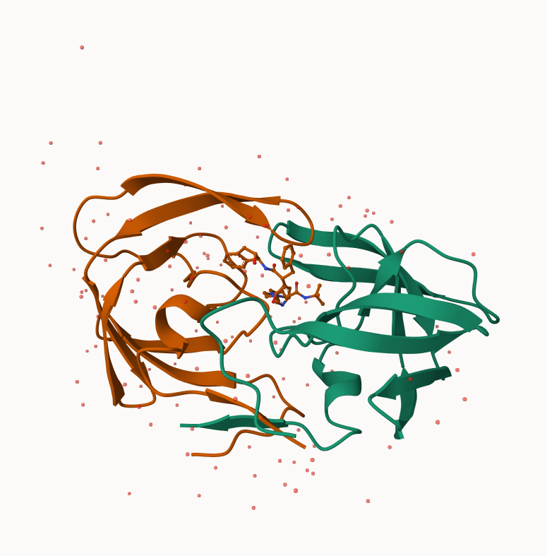
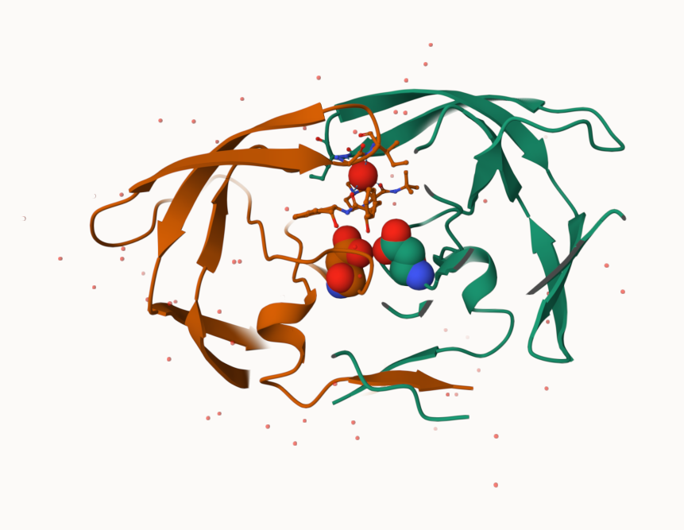
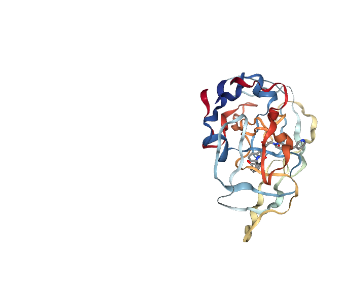
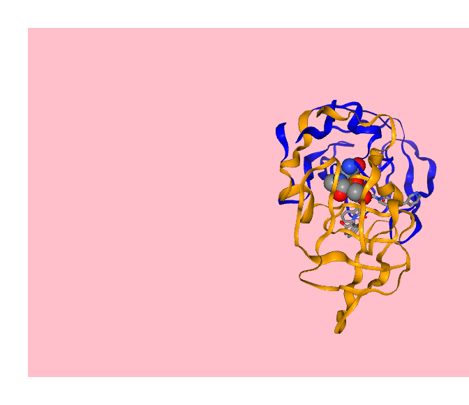
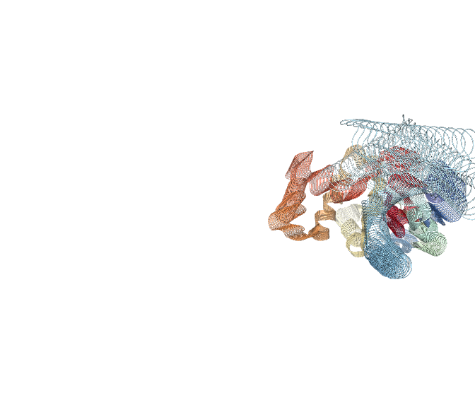

# Class 09: Structural Bioinformatics (pt1)
Charlize Molitor (PID: A18515740)

- [the PDB database](#the-pdb-database)
- [Exploring PDB structures](#exploring-pdb-structures)
- [PDB object in R](#pdb-object-in-r)
- [Predict protein flexibility](#predict-protein-flexibility)

## the PDB database

The main database for structural biology is called the PDB. Let’s have a
look at what it contains:

Download a CSV file from the PDB site (accessible from “Analyze” \> “PDB
Statistics” \> “by Experimental Method and Molecular Type”.

``` r
stats <- read.csv("Data Export Summary.csv")
stats
```

               Molecular.Type   X.ray     EM    NMR Integrative Multiple.methods
    1          Protein (only) 176,204 20,299 12,708         342              218
    2 Protein/Oligosaccharide  10,279  3,385     34           8               11
    3              Protein/NA   9,007  5,897    287          24                7
    4     Nucleic acid (only)   3,066    200  1,553           2               15
    5                   Other     173     13     33           3                0
    6  Oligosaccharide (only)      11      0      6           0                1
      Neutron Other   Total
    1      83    32 209,886
    2       1     0  13,718
    3       0     0  15,222
    4       3     1   4,840
    5       0     0     222
    6       0     4      22

``` r
stats$Total
```

    [1] "209,886" "13,718"  "15,222"  "4,840"   "222"     "22"     

Oh, these are characters not numeric…

``` r
as.numeric(sub(",", "", stats$Total))
```

    [1] 209886  13718  15222   4840    222     22

``` r
library(readr)


stats <- read_csv("Data Export Summary.csv")
stats
```

    # A tibble: 6 × 9
      `Molecular Type`    `X-ray`    EM   NMR Integrative `Multiple methods` Neutron
      <chr>                 <dbl> <dbl> <dbl>       <dbl>              <dbl>   <dbl>
    1 Protein (only)       176204 20299 12708         342                218      83
    2 Protein/Oligosacch…   10279  3385    34           8                 11       1
    3 Protein/NA             9007  5897   287          24                  7       0
    4 Nucleic acid (only)    3066   200  1553           2                 15       3
    5 Other                   173    13    33           3                  0       0
    6 Oligosaccharide (o…      11     0     6           0                  1       0
    # ℹ 2 more variables: Other <dbl>, Total <dbl>

``` r
n.total <- sum(stats$Total)
n.total
```

    [1] 243910

> Q1: What percentage of structures in the PDB are solved by X-Ray and
> Electron Microscopy. Give your answer to 2 significant figures

``` r
n.xray <- sum(stats$`X-ray`)
percent.xray <- n.xray / n.total * 100
percent.xray
```

    [1] 81.48087

There are 81.48 percent Xray structures in the PDB

``` r
n.em <-sum(stats $ `EM`)
percent.em <- n.em / n.total * 100
percent.em 
```

    [1] 12.21516

There are 12.22, percent EM structures in the PDB

> Q2: What proportion of structures in the PDB are protein?

``` r
round(stats$Total[1]/n.total * 100, 2)
```

    [1] 86.05

## Exploring PDB structures

Package for structural bioinformatics

``` r
library(bio3d)

hiv <- read.pdb("1hsg")
```

      Note: Accessing on-line PDB file

``` r
hiv
```


     Call:  read.pdb(file = "1hsg")

       Total Models#: 1
         Total Atoms#: 1686,  XYZs#: 5058  Chains#: 2  (values: A B)

         Protein Atoms#: 1514  (residues/Calpha atoms#: 198)
         Nucleic acid Atoms#: 0  (residues/phosphate atoms#: 0)

         Non-protein/nucleic Atoms#: 172  (residues: 128)
         Non-protein/nucleic resid values: [ HOH (127), MK1 (1) ]

       Protein sequence:
          PQITLWQRPLVTIKIGGQLKEALLDTGADDTVLEEMSLPGRWKPKMIGGIGGFIKVRQYD
          QILIEICGHKAIGTVLVGPTPVNIIGRNLLTQIGCTLNFPQITLWQRPLVTIKIGGQLKE
          ALLDTGADDTVLEEMSLPGRWKPKMIGGIGGFIKVRQYDQILIEICGHKAIGTVLVGPTP
          VNIIGRNLLTQIGCTLNF

    + attr: atom, xyz, seqres, helix, sheet,
            calpha, remark, call

Let’s first use the Mol\* viewer to explore this structure.



And a view of the ligand (ball and stick) with catalytic ASP 25 amino
acids(spacefill) and all the important active site water molecule
(spacefill)



## PDB object in R

``` r
head(hiv$atom)
```

      type eleno elety  alt resid chain resno insert      x      y     z o     b
    1 ATOM     1     N <NA>   PRO     A     1   <NA> 29.361 39.686 5.862 1 38.10
    2 ATOM     2    CA <NA>   PRO     A     1   <NA> 30.307 38.663 5.319 1 40.62
    3 ATOM     3     C <NA>   PRO     A     1   <NA> 29.760 38.071 4.022 1 42.64
    4 ATOM     4     O <NA>   PRO     A     1   <NA> 28.600 38.302 3.676 1 43.40
    5 ATOM     5    CB <NA>   PRO     A     1   <NA> 30.508 37.541 6.342 1 37.87
    6 ATOM     6    CG <NA>   PRO     A     1   <NA> 29.296 37.591 7.162 1 38.40
      segid elesy charge
    1  <NA>     N   <NA>
    2  <NA>     C   <NA>
    3  <NA>     C   <NA>
    4  <NA>     O   <NA>
    5  <NA>     C   <NA>
    6  <NA>     C   <NA>

Extract the sequence

``` r
pdbseq(hiv)
```

      1   2   3   4   5   6   7   8   9  10  11  12  13  14  15  16  17  18  19  20 
    "P" "Q" "I" "T" "L" "W" "Q" "R" "P" "L" "V" "T" "I" "K" "I" "G" "G" "Q" "L" "K" 
     21  22  23  24  25  26  27  28  29  30  31  32  33  34  35  36  37  38  39  40 
    "E" "A" "L" "L" "D" "T" "G" "A" "D" "D" "T" "V" "L" "E" "E" "M" "S" "L" "P" "G" 
     41  42  43  44  45  46  47  48  49  50  51  52  53  54  55  56  57  58  59  60 
    "R" "W" "K" "P" "K" "M" "I" "G" "G" "I" "G" "G" "F" "I" "K" "V" "R" "Q" "Y" "D" 
     61  62  63  64  65  66  67  68  69  70  71  72  73  74  75  76  77  78  79  80 
    "Q" "I" "L" "I" "E" "I" "C" "G" "H" "K" "A" "I" "G" "T" "V" "L" "V" "G" "P" "T" 
     81  82  83  84  85  86  87  88  89  90  91  92  93  94  95  96  97  98  99   1 
    "P" "V" "N" "I" "I" "G" "R" "N" "L" "L" "T" "Q" "I" "G" "C" "T" "L" "N" "F" "P" 
      2   3   4   5   6   7   8   9  10  11  12  13  14  15  16  17  18  19  20  21 
    "Q" "I" "T" "L" "W" "Q" "R" "P" "L" "V" "T" "I" "K" "I" "G" "G" "Q" "L" "K" "E" 
     22  23  24  25  26  27  28  29  30  31  32  33  34  35  36  37  38  39  40  41 
    "A" "L" "L" "D" "T" "G" "A" "D" "D" "T" "V" "L" "E" "E" "M" "S" "L" "P" "G" "R" 
     42  43  44  45  46  47  48  49  50  51  52  53  54  55  56  57  58  59  60  61 
    "W" "K" "P" "K" "M" "I" "G" "G" "I" "G" "G" "F" "I" "K" "V" "R" "Q" "Y" "D" "Q" 
     62  63  64  65  66  67  68  69  70  71  72  73  74  75  76  77  78  79  80  81 
    "I" "L" "I" "E" "I" "C" "G" "H" "K" "A" "I" "G" "T" "V" "L" "V" "G" "P" "T" "P" 
     82  83  84  85  86  87  88  89  90  91  92  93  94  95  96  97  98  99 
    "V" "N" "I" "I" "G" "R" "N" "L" "L" "T" "Q" "I" "G" "C" "T" "L" "N" "F" 

``` r
chainA_seq <- pdbseq(trim.pdb(hiv, chain = "A"))
```

I can interatively view these PDB objects in R with the new
**bio3dview** package. This is not on CRAN yet

To install this I can setup **pak** package and use it to install
**bio3dview** from GitHub. In my console I first run
**install.packages(“pak”)**, then I run
**pak::pak(“bioboot/bio3dview”)** and **install.packages(“NGLVieweR”)**

``` r
library(bio3dview)

view.pdb(hiv)
```

    PhantomJS not found. You can install it with webshot::install_phantomjs(). If it is installed, please make sure the phantomjs executable can be found via the PATH variable.

    file:////private/var/folders/qq/5dd7db0d36v0_h2n3j30cqg80000gn/T/RtmpIfuVTO/file8c862ac8e7d6/widget8c866beca88b.html screenshot completed



Change some settings

``` r
sel <- atom.select(hiv, resno=25)

view.pdb(hiv, highlight = sel,highlight.style= "spacefill", colorScheme = "chain", col = c("blue", "orange"), backgroundColor = "pink")
```

    file:////private/var/folders/qq/5dd7db0d36v0_h2n3j30cqg80000gn/T/RtmpIfuVTO/file8c862922adc0/widget8c8623bd2d59.html screenshot completed



## Predict protein flexibility

We can run a bioinformatics calculation to predict protein dynamics-
i.e. functional motions. We will use the `nma()` function:

``` r
adk <- read.pdb("6s36")
```

      Note: Accessing on-line PDB file
       PDB has ALT records, taking A only, rm.alt=TRUE

``` r
adk
```


     Call:  read.pdb(file = "6s36")

       Total Models#: 1
         Total Atoms#: 1898,  XYZs#: 5694  Chains#: 1  (values: A)

         Protein Atoms#: 1654  (residues/Calpha atoms#: 214)
         Nucleic acid Atoms#: 0  (residues/phosphate atoms#: 0)

         Non-protein/nucleic Atoms#: 244  (residues: 244)
         Non-protein/nucleic resid values: [ CL (3), HOH (238), MG (2), NA (1) ]

       Protein sequence:
          MRIILLGAPGAGKGTQAQFIMEKYGIPQISTGDMLRAAVKSGSELGKQAKDIMDAGKLVT
          DELVIALVKERIAQEDCRNGFLLDGFPRTIPQADAMKEAGINVDYVLEFDVPDELIVDKI
          VGRRVHAPSGRVYHVKFNPPKVEGKDDVTGEELTTRKDDQEETVRKRLVEYHQMTAPLIG
          YYSKEAEAGNTKYAKVDGTKPVAEVRADLEKILG

    + attr: atom, xyz, seqres, helix, sheet,
            calpha, remark, call

``` r
m <- nma(adk)
```

     Building Hessian...        Done in 0.02 seconds.
     Diagonalizing Hessian...   Done in 0.098 seconds.

``` r
plot(m)
```


Generate a “trajectory” of predicted motion

``` r
mktrj(m, file ="ADK_nma.pdb")
```

``` r
view.nma(m)
```

    file:////private/var/folders/qq/5dd7db0d36v0_h2n3j30cqg80000gn/T/RtmpIfuVTO/file8c8679a7f53/widget8c86301d260b.html screenshot completed


