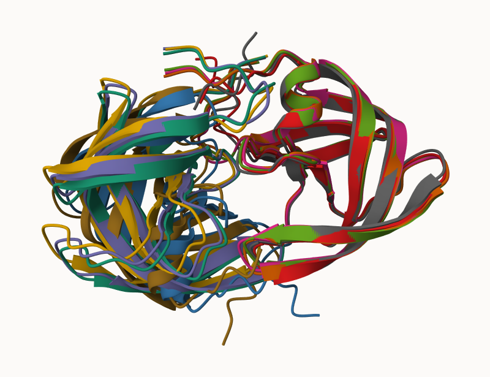
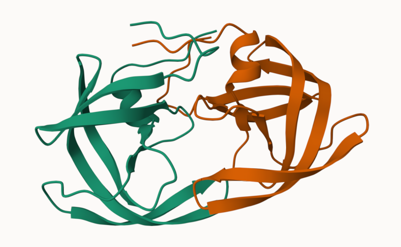
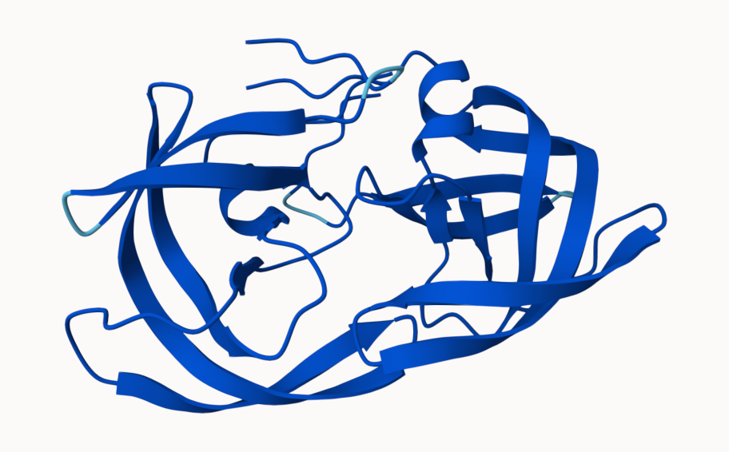
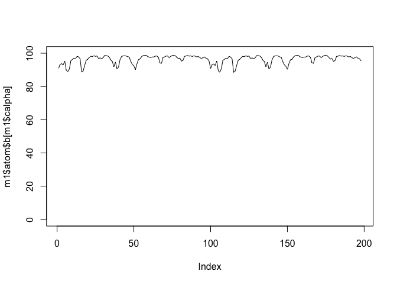
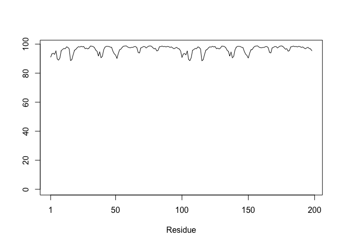

# Class 11: Structural Bioinformatics pt2
Charlize Molitor (PID:A18515740)

- [AlphaFold DB](#alphafold-db)
- [Generating your own structure
  predications](#generating-your-own-structure-predications)
- [Custom anaylsis of resulting models in
  R](#custom-anaylsis-of-resulting-models-in-r)
  - [Residue conservation from alignment
    file](#residue-conservation-from-alignment-file)

## AlphaFold DB

The EBI maintains the largest database of AlphaFold structure prediction
models at: https://alphafold.ebi.ac.uk

From last class(before Halloween) we saw that the PDB had 244,290 (Oct
2025)

The total number of protein sequences in UniProtKB is 199,579,901

> **Key point**: This is a tiny fraction of sequences space that has
> structural coverage(0.12%)

``` r
244290/199579901 * 100
```

    [1] 0.1224021

AFDB is attempting to adress this gap…

There are two “Quality Scores” from AlphaFold one for residues (i.e each
amino acid) called **plDDT** score. The other **PAE** score measures the
confidence in the relative position of two residues (i.e a score for
every pair of residuals)

## Generating your own structure predications

Figure of 5 generated HIV-PR models 

And the top ranked model



plDDt score for model 1



and model 5


# Custom anaylsis of resulting models in R

Read key result files into R. The first thing I need to know is what my
results directory/folder is called (i.e it’s name is different for every
run/job )

``` r
results_dir <- "HIVPR_dimer_23119/"

# File names for all PDB models
pdb_files <- list.files(path=results_dir,
                        pattern="*.pdb",
                        full.names = TRUE)

# Print our PDB file names
basename(pdb_files)
```

    [1] "HIVPR_dimer_23119_unrelaxed_rank_001_alphafold2_multimer_v3_model_4_seed_000.pdb"
    [2] "HIVPR_dimer_23119_unrelaxed_rank_002_alphafold2_multimer_v3_model_1_seed_000.pdb"
    [3] "HIVPR_dimer_23119_unrelaxed_rank_003_alphafold2_multimer_v3_model_5_seed_000.pdb"
    [4] "HIVPR_dimer_23119_unrelaxed_rank_004_alphafold2_multimer_v3_model_2_seed_000.pdb"
    [5] "HIVPR_dimer_23119_unrelaxed_rank_005_alphafold2_multimer_v3_model_3_seed_000.pdb"

``` r
library(bio3d)

m1 <- read.pdb(pdb_files[1])
m1
```


     Call:  read.pdb(file = pdb_files[1])

       Total Models#: 1
         Total Atoms#: 1514,  XYZs#: 4542  Chains#: 2  (values: A B)

         Protein Atoms#: 1514  (residues/Calpha atoms#: 198)
         Nucleic acid Atoms#: 0  (residues/phosphate atoms#: 0)

         Non-protein/nucleic Atoms#: 0  (residues: 0)
         Non-protein/nucleic resid values: [ none ]

       Protein sequence:
          PQITLWQRPLVTIKIGGQLKEALLDTGADDTVLEEMSLPGRWKPKMIGGIGGFIKVRQYD
          QILIEICGHKAIGTVLVGPTPVNIIGRNLLTQIGCTLNFPQITLWQRPLVTIKIGGQLKE
          ALLDTGADDTVLEEMSLPGRWKPKMIGGIGGFIKVRQYDQILIEICGHKAIGTVLVGPTP
          VNIIGRNLLTQIGCTLNF

    + attr: atom, xyz, calpha, call

``` r
head(m1$atom)
```

      type eleno elety  alt resid chain resno insert      x      y      z o     b
    1 ATOM     1     N <NA>   PRO     A     1   <NA> 16.938 -3.990 -6.129 1 90.94
    2 ATOM     2    CA <NA>   PRO     A     1   <NA> 16.938 -2.557 -6.430 1 90.94
    3 ATOM     3     C <NA>   PRO     A     1   <NA> 16.438 -1.707 -5.266 1 90.94
    4 ATOM     4    CB <NA>   PRO     A     1   <NA> 15.992 -2.449 -7.629 1 90.94
    5 ATOM     5     O <NA>   PRO     A     1   <NA> 15.836 -2.232 -4.324 1 90.94
    6 ATOM     6    CG <NA>   PRO     A     1   <NA> 15.070 -3.623 -7.496 1 90.94
      segid elesy charge
    1  <NA>     N   <NA>
    2  <NA>     C   <NA>
    3  <NA>     C   <NA>
    4  <NA>     C   <NA>
    5  <NA>     O   <NA>
    6  <NA>     C   <NA>

``` r
plot(m1$atom$b[m1$calpha], type="l", ylim=c(0,100))
```



``` r
plot.bio3d(m1$atom$b[m1$calpha], type="l")
```



## Residue conservation from alignment file

``` r
aln_file <- list.files(path=results_dir,
                       pattern=".a3m$",
                        full.names = TRUE)
aln_file
```

    [1] "HIVPR_dimer_23119//HIVPR_dimer_23119.a3m"

``` r
aln <- read.fasta(aln_file[1], to.upper = TRUE)
```

    [1] " ** Duplicated sequence id's: 101 **"
    [2] " ** Duplicated sequence id's: 101 **"

How many sequences are in this alignment

``` r
dim(aln$ali)
```

    [1] 5397  132

``` r
sim <- conserv(aln)

plotb3(sim[1:99], ylab="Conservation Score")
```


``` r
con <- consensus(aln, cutoff = 0.9)
con$seq
```

      [1] "-" "-" "-" "-" "-" "-" "-" "-" "-" "-" "-" "-" "-" "-" "-" "-" "-" "-"
     [19] "-" "-" "-" "-" "-" "-" "D" "T" "G" "A" "-" "-" "-" "-" "-" "-" "-" "-"
     [37] "-" "-" "-" "-" "-" "-" "-" "-" "-" "-" "-" "-" "-" "-" "-" "-" "-" "-"
     [55] "-" "-" "-" "-" "-" "-" "-" "-" "-" "-" "-" "-" "-" "-" "-" "-" "-" "-"
     [73] "-" "-" "-" "-" "-" "-" "-" "-" "-" "-" "-" "-" "-" "-" "-" "-" "-" "-"
     [91] "-" "-" "-" "-" "-" "-" "-" "-" "-" "-" "-" "-" "-" "-" "-" "-" "-" "-"
    [109] "-" "-" "-" "-" "-" "-" "-" "-" "-" "-" "-" "-" "-" "-" "-" "-" "-" "-"
    [127] "-" "-" "-" "-" "-" "-"
