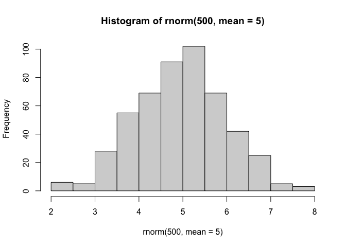
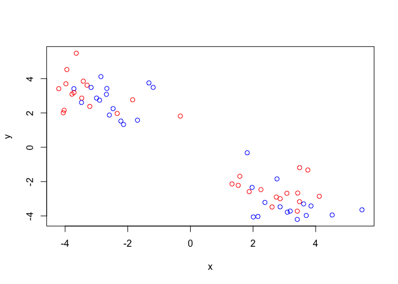
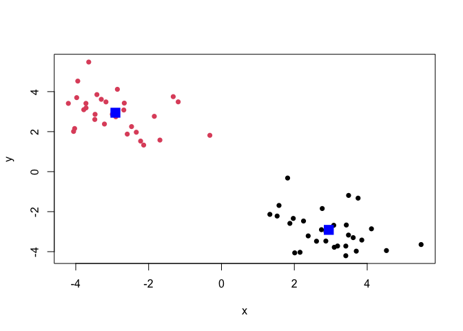
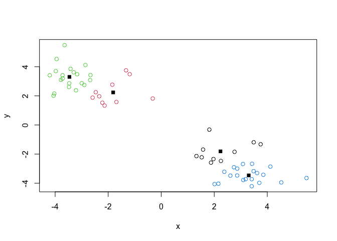
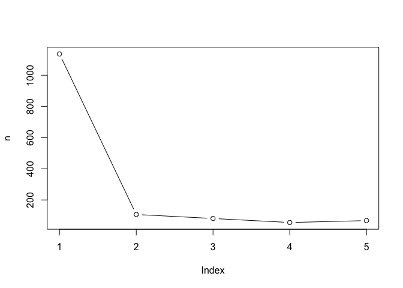
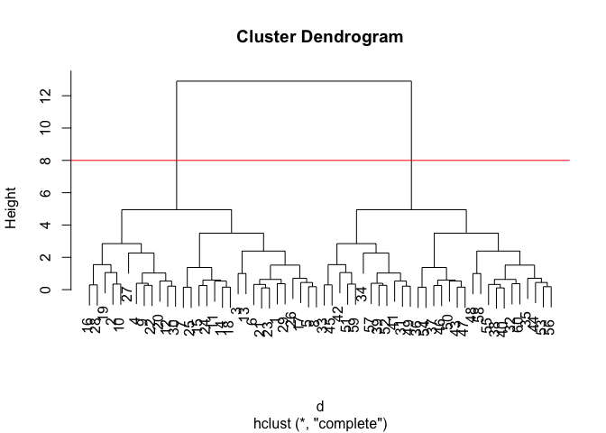
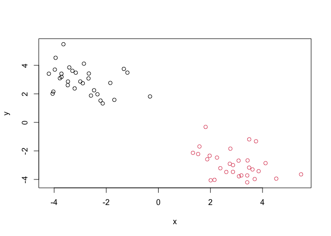

# Class 7: Machine Learning 1
Charlize Molitor (PID: A18515740)

Today we will be exploring some fundamental machine learning methods
including clustering and dimensionality reduction

# K-means clustering

To see how this works let’s first makeup some data to cluster where we
know what the answer should be. We can use the `rnorm()` function to
help here:

``` r
hist(rnorm(500, mean = 5))
```



``` r
x <- c(rnorm(30, mean= -3), rnorm(30, mean=3))
y <- rev(x)
```

``` r
x <-cbind(x,y)
plot(x)
```


The function for K-means clustering in “base” R is `kmeans()`

``` r
k <-kmeans(x, centers = 2)
k
```

    K-means clustering with 2 clusters of sizes 30, 30

    Cluster means:
              x         y
    1  2.945711 -2.911478
    2 -2.911478  2.945711

    Clustering vector:
     [1] 2 2 2 2 2 2 2 2 2 2 2 2 2 2 2 2 2 2 2 2 2 2 2 2 2 2 2 2 2 2 1 1 1 1 1 1 1 1
    [39] 1 1 1 1 1 1 1 1 1 1 1 1 1 1 1 1 1 1 1 1 1 1

    Within cluster sum of squares by cluster:
    [1] 53.39788 53.39788
     (between_SS / total_SS =  90.6 %)

    Available components:

    [1] "cluster"      "centers"      "totss"        "withinss"     "tot.withinss"
    [6] "betweenss"    "size"         "iter"         "ifault"      

To get the results of the returned list object we can use the dollar `$`
syntax \>Q. How many points are in each cluster?

``` r
k$size
```

    [1] 30 30

> Q. What ‘component’ of your result object details -cluster
> assignment/membership -cluster center?

``` r
k$cluster
```

     [1] 2 2 2 2 2 2 2 2 2 2 2 2 2 2 2 2 2 2 2 2 2 2 2 2 2 2 2 2 2 2 1 1 1 1 1 1 1 1
    [39] 1 1 1 1 1 1 1 1 1 1 1 1 1 1 1 1 1 1 1 1 1 1

``` r
k$centers
```

              x         y
    1  2.945711 -2.911478
    2 -2.911478  2.945711

> Q. Make a clustering results figure of the data colored by cluster
> membership and show cluster centers

``` r
plot(x, col=c("red", "blue"))
```



``` r
plot(x, col=k$cluster, pch=16)
points(k$centers, col="blue", pch=15, cex=2)
```



K-means clustering is very popular as it is very fast and relatively
straight forward: it takes numeric data as input and returns the
clusters membership vector etc.

The “issue” is we tell `kmeans()` how many clusters we want!

> Q. Run kmeans again and cluster into 4 grps/clusters and plot the
> results like we did above?

``` r
k4 <-kmeans(x, centers = 4)
plot(x, col=k4$cluster)
points(k4$centers,pch = 15)
```



Scree plot to pick k `centers` value

brute-force

``` r
k1 <- kmeans(x, centers=1)
k2 <- kmeans(x, centers=2)
k3 <- kmeans(x, centers=3)
k4 <- kmeans(x, centers=4)
k5 <- kmeans(x, centers=5)
```

``` r
z <- c( k1$tot.withinss, 
        k2$tot.withinss,
        k3$tot.withinss,
        k4$tot.withinss,
        k5$tot.withinss)
plot(z,type="b")
```


``` r
n <- NULL
for(i in 1:5) {
  n <- c(n, kmeans(x, centers=i)$tot.withinss)
}
plot(n, typ="b")
```



# Hierarchical Clustering

The mean “base” R function for Hierarchical clustering is called
`hclust()`. Here we can’t input our data we need to first calculate a
distance matrix ( e.g. `dist()`) for our data and use this as input to
`hclust()`

``` r
d <- dist(x)
hc <-hclust(d)
hc
```


    Call:
    hclust(d = d)

    Cluster method   : complete 
    Distance         : euclidean 
    Number of objects: 60 

There is a plot method for hclust results lets try it

``` r
plot(hc)
abline(h=8, col="red")
```



To get our cluster “membership” vector (i.e. our main clustering
results) we can “cut” the tree at any given height or at a height that
yields a given “k” groups.

``` r
cutree(hc, h=8)
```

     [1] 1 1 1 1 1 1 1 1 1 1 1 1 1 1 1 1 1 1 1 1 1 1 1 1 1 1 1 1 1 1 2 2 2 2 2 2 2 2
    [39] 2 2 2 2 2 2 2 2 2 2 2 2 2 2 2 2 2 2 2 2 2 2

``` r
grps <- cutree(hc, k=2)
```

> Q. Plot the data with out hclust result coloring

``` r
plot(x, col=grps)
```



# Principle Component Analysis (PCA)

# PCA of UK food data

Import food data from an online CSV file:

``` r
url <- "https://tinyurl.com/UK-foods"
x <- read.csv(url)
head(x)
```

                   X England Wales Scotland N.Ireland
    1         Cheese     105   103      103        66
    2  Carcass_meat      245   227      242       267
    3    Other_meat      685   803      750       586
    4           Fish     147   160      122        93
    5 Fats_and_oils      193   235      184       209
    6         Sugars     156   175      147       139

``` r
rownames(x) <- x[,1]
x <- x[,-1]
x
```

                        England Wales Scotland N.Ireland
    Cheese                  105   103      103        66
    Carcass_meat            245   227      242       267
    Other_meat              685   803      750       586
    Fish                    147   160      122        93
    Fats_and_oils           193   235      184       209
    Sugars                  156   175      147       139
    Fresh_potatoes          720   874      566      1033
    Fresh_Veg               253   265      171       143
    Other_Veg               488   570      418       355
    Processed_potatoes      198   203      220       187
    Processed_Veg           360   365      337       334
    Fresh_fruit            1102  1137      957       674
    Cereals                1472  1582     1462      1494
    Beverages                57    73       53        47
    Soft_drinks            1374  1256     1572      1506
    Alcoholic_drinks        375   475      458       135
    Confectionery            54    64       62        41

``` r
x <- read.csv(url, row.names = 1)
x
```

                        England Wales Scotland N.Ireland
    Cheese                  105   103      103        66
    Carcass_meat            245   227      242       267
    Other_meat              685   803      750       586
    Fish                    147   160      122        93
    Fats_and_oils           193   235      184       209
    Sugars                  156   175      147       139
    Fresh_potatoes          720   874      566      1033
    Fresh_Veg               253   265      171       143
    Other_Veg               488   570      418       355
    Processed_potatoes      198   203      220       187
    Processed_Veg           360   365      337       334
    Fresh_fruit            1102  1137      957       674
    Cereals                1472  1582     1462      1494
    Beverages                57    73       53        47
    Soft_drinks            1374  1256     1572      1506
    Alcoholic_drinks        375   475      458       135
    Confectionery            54    64       62        41

Some base figures

``` r
barplot(as.matrix(x), beside=T, col=rainbow(nrow(x)))
```


``` r
barplot(as.matrix(x), col=rainbow(nrow(x)))
```


There is one plot that can be useful for small datasets:

``` r
pairs(x, col=rainbow(nrow(x)), pch=16)
```


> Main point: It can be difficult to spot major trends and patterns even
> in relatively small multivariate datasets( here we only have 17
> dimensions, typically we have 1000s)

## PCA to the rescue

The main function in “base” R for PCA is called `prcomp()`

I will take the transpose of our food data so the “foods” are in
columns:

``` r
pca <- prcomp(t(x))
summary(pca)
```

    Importance of components:
                                PC1      PC2      PC3     PC4
    Standard deviation     324.1502 212.7478 73.87622 2.7e-14
    Proportion of Variance   0.6744   0.2905  0.03503 0.0e+00
    Cumulative Proportion    0.6744   0.9650  1.00000 1.0e+00

``` r
cols <- c("orange", "red", "blue", "darkgreen")
plot(pca$x[,1], pca$x[,2], col=cols, pch=16)
```


``` r
library(ggplot2)
```

``` r
ggplot(pca$x) + 
  aes(PC1, PC2) +
  geom_point(col = cols)
```


``` r
ggplot(pca$rotation) +
  aes(PC1, rownames(pca$rotation)) +
  geom_col()
```


PCA looks super useful and we will come back to describe this further
next day :)
