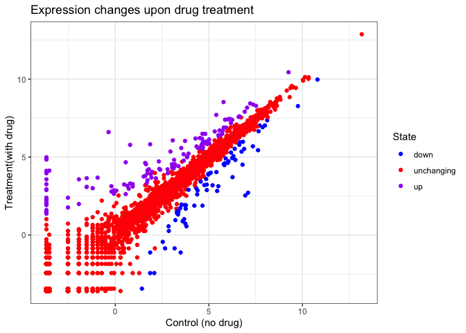
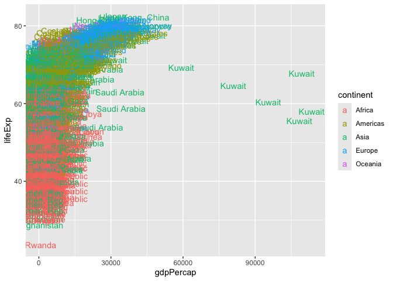
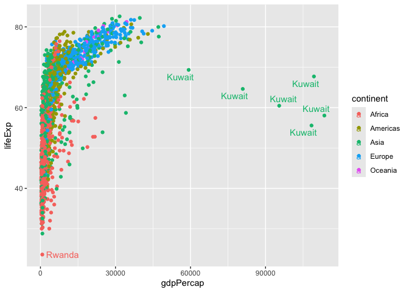
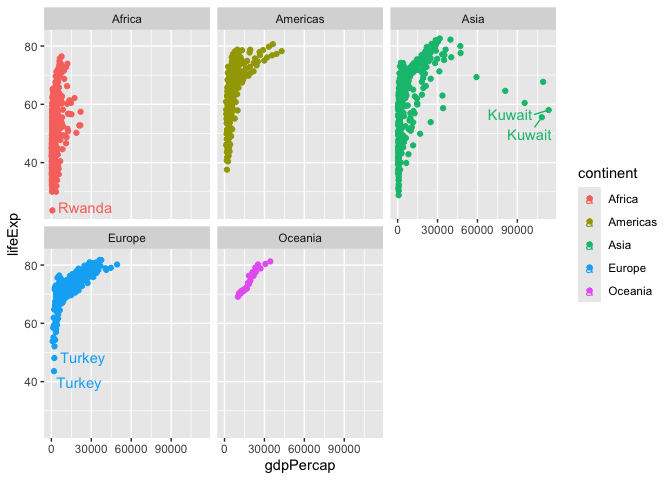

# Class 5: Data Viz with ggplot
Charlize Molitor(PID:A18515740)

Today we are exploring the **gggplot**package and how to make nice
figures in R.

There are lots of ways to make figures and plot in R. These include:

-so called “Base R” -and add on packages in **ggplot2**

Here is a simple “base” R plot.

``` r
head(cars)
```

      speed dist
    1     4    2
    2     4   10
    3     7    4
    4     7   22
    5     8   16
    6     9   10

We can simply pass to the `plot()` function

``` r
plot(cars)
```


> Key-point:Base R is quick but not so nice looking in some folks eyes.

Let’s see how we can plot this with **ggplot**…

1st I need to install this add-on package. For this we use the
`install.packages()` function - **WE DO THIS IN THE CONSOLE, NOT our
report**. This is a one time only deal.

2nd We need to load the package with `library()` function every time we
want to use it.

``` r
library(ggplot2)
ggplot(cars)
```


Every ggplot is composed of at leasr 3 layers:

\-**data**(i.e a data frame with the things you want to plot),
-aesthetics **aes()** that map the columns of data that your plot
features(i.e aesthetics) -geoms like **geom_point()** that srt how the
plot apprears

``` r
ggplot(cars)+
  aes(x=speed, y=dist) +
  geom_point()
```


> Key point: For simple “canned” graphs base R is quicker but as things
> get more custom and elobrate then ggplot wins out…

Let’s add more layers to out ggplot

Add a line showing the relationship between x and y Add a title Add
custom axis labels “Speed(MPH) and Distance(ft)” Change the theme…

``` r
ggplot(cars)+
  aes(x=speed, y=dist) +
  geom_point() +
  geom_smooth(method = "lm", se=FALSE) + 
  labs(title = "Silly plot of Speed vs Stopping distance",
       x= "Speed (MPH)", 
       y= "Distance (ft)") + 
  theme_bw()
```

    `geom_smooth()` using formula = 'y ~ x'


## Going further

Read some gene expression data

``` r
url <- "https://bioboot.github.io/bimm143_S20/class-material/up_down_expression.txt"
genes <- read.delim(url)
head(genes)
```

            Gene Condition1 Condition2      State
    1      A4GNT -3.6808610 -3.4401355 unchanging
    2       AAAS  4.5479580  4.3864126 unchanging
    3      AASDH  3.7190695  3.4787276 unchanging
    4       AATF  5.0784720  5.0151916 unchanging
    5       AATK  0.4711421  0.5598642 unchanging
    6 AB015752.4 -3.6808610 -3.5921390 unchanging

> Q1. How many gene are in this wee dataset?

``` r
nrow(genes)
```

    [1] 5196

``` r
ncol(genes)
```

    [1] 4

> Q2. How many “up” regulated genes are there?

``` r
sum( genes$State == "up" )
```

    [1] 127

A useful function for counting up occurances of things in a vector is
the `table ()` function.

``` r
table( genes$State )
```


          down unchanging         up 
            72       4997        127 

Make a v1 figure

``` r
p <- ggplot(genes) +
  aes(x =Condition1,
       y=Condition2, 
      col=State) +
  geom_point() 

p
```


``` r
p + 
  scale_colour_manual(values=c("blue", "red", "purple")) + labs(title="Expression changes upon drug treatment", 
     x="Control (no drug)", 
     y= "Treatment(with drug)") +
  theme_bw()
```



## More plotting

Read in the gapminder database

``` r
# File location online
url <- "https://raw.githubusercontent.com/jennybc/gapminder/master/inst/extdata/gapminder.tsv"

gapminder <- read.delim(url)
```

Let’s have a wee peak

``` r
head( gapminder, 3)
```

          country continent year lifeExp      pop gdpPercap
    1 Afghanistan      Asia 1952  28.801  8425333  779.4453
    2 Afghanistan      Asia 1957  30.332  9240934  820.8530
    3 Afghanistan      Asia 1962  31.997 10267083  853.1007

``` r
tail(gapminder, 3)
```

          country continent year lifeExp      pop gdpPercap
    1702 Zimbabwe    Africa 1997  46.809 11404948  792.4500
    1703 Zimbabwe    Africa 2002  39.989 11926563  672.0386
    1704 Zimbabwe    Africa 2007  43.487 12311143  469.7093

> Q4. How many different country values are in this dataset?

``` r
nrow(gapminder)
```

    [1] 1704

``` r
length(table(gapminder$country))
```

    [1] 142

> Q5. How many different continents values are in this dataset?

``` r
unique(gapminder$continent)
```

    [1] "Asia"     "Europe"   "Africa"   "Americas" "Oceania" 

``` r
ggplot(gapminder) +
  aes(gdpPercap, lifeExp, col=continent) + 
  geom_point()
```


``` r
ggplot(gapminder) +
  aes(gdpPercap, lifeExp, col=continent, label=country) + 
  geom_text() 
```



I can use the **ggrepel** package to make more sensible labels here

``` r
library(ggrepel)
ggplot(gapminder) +
  aes(gdpPercap, lifeExp, col=continent, label=country) + 
  geom_point() +
  geom_text_repel()
```

    Warning: ggrepel: 1697 unlabeled data points (too many overlaps). Consider
    increasing max.overlaps



I want a seperate pannel per continent

``` r
ggplot(gapminder) +
  aes(gdpPercap, lifeExp, col=continent, label=country) + 
  geom_point() +
  geom_text_repel() +
  facet_wrap(~continent)
```

    Warning: ggrepel: 623 unlabeled data points (too many overlaps). Consider
    increasing max.overlaps

    Warning: ggrepel: 358 unlabeled data points (too many overlaps). Consider
    increasing max.overlaps

    Warning: ggrepel: 300 unlabeled data points (too many overlaps). Consider
    increasing max.overlaps

    Warning: ggrepel: 24 unlabeled data points (too many overlaps). Consider
    increasing max.overlaps

    Warning: ggrepel: 394 unlabeled data points (too many overlaps). Consider
    increasing max.overlaps



## Summary

The main advantges of ggplot over base R plot are :

1.  **Grammar of Graphics** – ggplot2 is built on a clear, consistent
    “grammar” that separates data, aesthetics, and geometries. This
    makes it easier to construct complex plots step‑by‑step and to
    modify individual layers without rewriting the whole graph.
2.  **Layered Design** – You can add multiple geometric objects (points,
    lines, ribbons, etc.) on top of each other with +. This encourages
    incremental building and easy tweaking of components such as
    annotations, smoothers, or facets.
3.  **Automatic Aesthetic Mapping** – Mapping variables to colour,
    shape, size, or transparency is handled inside aes(). ggplot2
    automatically generates appropriate legends and scales, reducing
    boilerplate code.
4.  **Faceting for Small‑Multiples** – facet_wrap() and facet_grid()
    split data into a matrix of sub‑plots with minimal effort, a feature
    that requires considerable manual work in base graphics.
5.  **Theme System** – Consistent styling is achieved through reusable
    themes (theme_minimal(), theme_bw(), custom theme() objects).
    Changing fonts, backgrounds, or gridlines across many plots is
    straightforward.
6.  **Built‑in Statistical Transformations** – Geoms like geom_smooth(),
    geom_histogram(), and geom_boxplot() automatically compute summaries
    (e.g., density, counts, quantiles) without extra code.
7.  **Extensibility** – A large ecosystem of extensions (e.g., ggrepel,
    gganimate, sf for spatial data) builds on the same grammar, allowing
    you to add labels, animations, or map layers with minimal learning
    curve.
8.  **Publication‑Ready Output** – Fine‑grained control over every
    visual element, combined with seamless integration with ggsave() for
    PDF, PNG, or vector formats, makes it easier to produce figures that
    meet journal standards.
9.  **Consistency Across Plot Types** – Whether you are creating a
    scatterplot, heatmap, or choropleth, the same syntax (ggplot(data) +
    geom\_\*() + …) applies, reducing the mental load of remembering
    different function signatures.

``` r
ggplot(mtcars) + 
  aes(x=mpg, y=disp) + 
  geom_point()
```


``` r
ggplot(mtcars, aes(mpg, disp)) + 
  geom_point()
```


