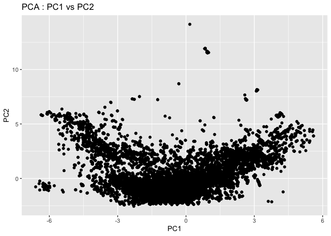
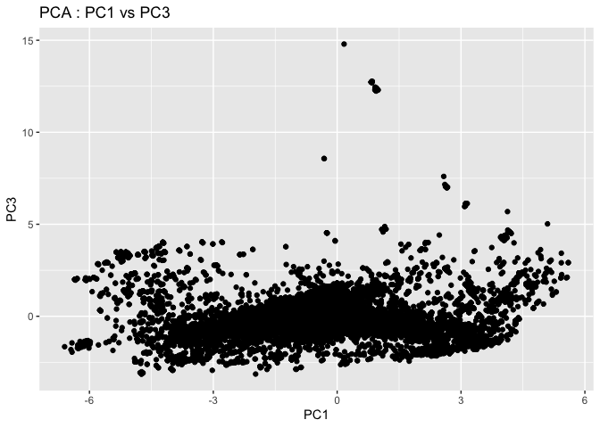
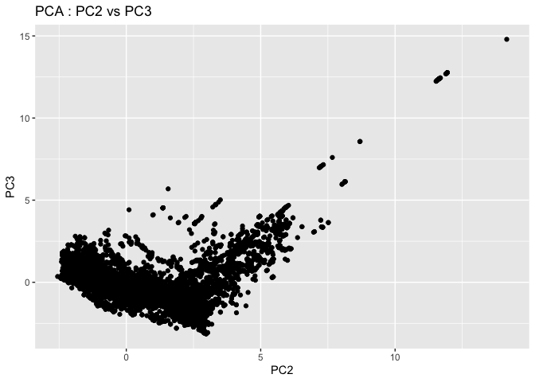

# Class 16
Charlize Molitor (PID: 18515740)

## Insert your files :)

``` r
library(readr)
myresults <- read_tsv("my_results.tsv")
```

    Rows: 19532 Columns: 12
    ── Column specification ────────────────────────────────────────────────────────
    Delimiter: "\t"
    chr  (2): NP_034603.2, XP_002663941.1
    dbl (10): 44.444, 90, 46, 1, 644, 733, 295, 380, 6.07e-20, 94.4

    ℹ Use `spec()` to retrieve the full column specification for this data.
    ℹ Specify the column types or set `show_col_types = FALSE` to quiet this message.

``` r
head(myresults)
```

    # A tibble: 6 × 12
      NP_034603.2 XP_002663941.1 `44.444`  `90`  `46`   `1` `644` `733` `295` `380`
      <chr>       <chr>             <dbl> <dbl> <dbl> <dbl> <dbl> <dbl> <dbl> <dbl>
    1 NP_034603.2 XP_021335885.1     41.7    96    46     2   644   733   295   386
    2 NP_034603.2 XP_021329952.2     43.2    74    41     1   660   733   217   289
    3 NP_036084.2 XP_073799717.1     28.2   209   140     6    17   220     1   204
    4 NP_036084.2 NP_001156326.1     25.9   205   143     3    27   224    24   226
    5 NP_036084.2 XP_073785644.1     24.3   136    97     1    87   216    18   153
    6 NP_036084.2 XP_068079900.1     26.6   143    98     3    87   224   112   252
    # ℹ 2 more variables: `6.07e-20` <dbl>, `94.4` <dbl>

## Remove the non-numerical columns from data using subset

``` r
new_data <- subset(myresults, select = -c(
NP_034603.2, XP_002663941.1))
head(new_data)
```

    # A tibble: 6 × 10
      `44.444`  `90`  `46`   `1` `644` `733` `295` `380` `6.07e-20` `94.4`
         <dbl> <dbl> <dbl> <dbl> <dbl> <dbl> <dbl> <dbl>      <dbl>  <dbl>
    1     41.7    96    46     2   644   733   295   386   4.43e-18   88.6
    2     43.2    74    41     1   660   733   217   289   2.21e- 9   61.2
    3     28.2   209   140     6    17   220     1   204   6.60e-10   58.5
    4     25.9   205   143     3    27   224    24   226   4.99e- 9   56.2
    5     24.3   136    97     1    87   216    18   153   2.22e- 7   50.4
    6     26.6   143    98     3    87   224   112   252   3.08e- 6   48.5

## Make your PCA

``` r
results <- prcomp(new_data, scale= TRUE)
summary(results)
```

    Importance of components:
                              PC1    PC2    PC3    PC4     PC5     PC6     PC7
    Standard deviation     1.8686 1.7899 1.1580 1.0267 0.83623 0.41328 0.17836
    Proportion of Variance 0.3492 0.3204 0.1341 0.1054 0.06993 0.01708 0.00318
    Cumulative Proportion  0.3492 0.6695 0.8036 0.9091 0.97899 0.99607 0.99925
                               PC8     PC9    PC10
    Standard deviation     0.07995 0.03330 0.00421
    Proportion of Variance 0.00064 0.00011 0.00000
    Cumulative Proportion  0.99989 1.00000 1.00000

## Create your first PCA graph

## PC1 vs PC2

``` r
library(ggplot2)
ggplot(results$x, aes(x = PC1, y = PC2))  +
  geom_point() + 
    ggtitle("PCA : PC1 vs PC2") + 
    xlab("PC1") + 
    ylab("PC2")
```



## PC1 vs PC3

``` r
library(ggplot2)
ggplot(results$x, aes(x = PC1, y = PC3))  +
  geom_point() + 
    ggtitle("PCA : PC1 vs PC3") + 
    xlab("PC1") + 
    ylab("PC3")
```



## PC2 vs PC3

``` r
library(ggplot2)
ggplot(results$x, aes(x = PC2, y = PC3))  +
  geom_point() + 
    ggtitle("PCA : PC2 vs PC3") + 
    xlab("PC2") + 
    ylab("PC3")
```


